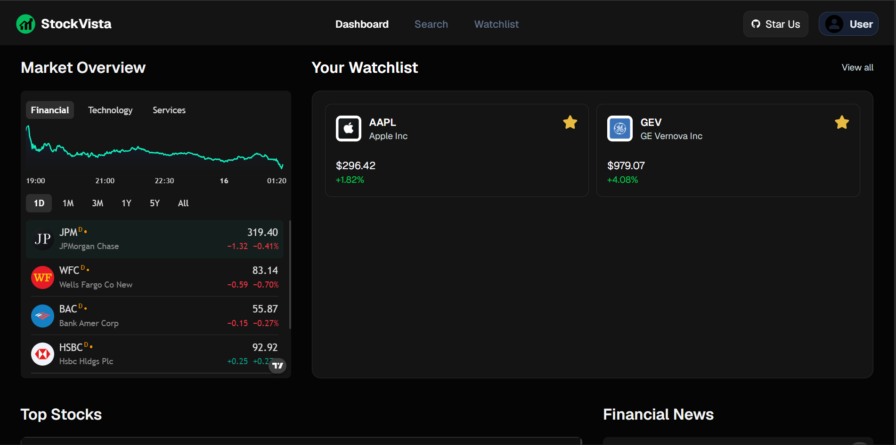
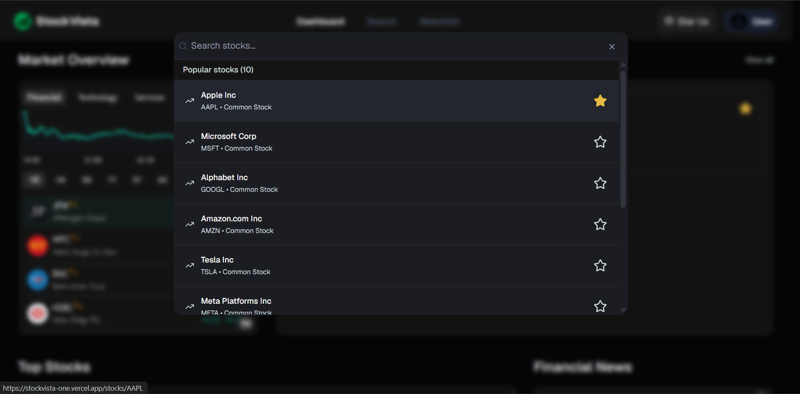
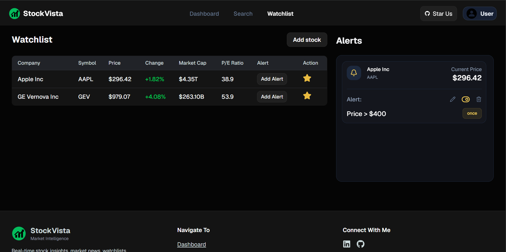
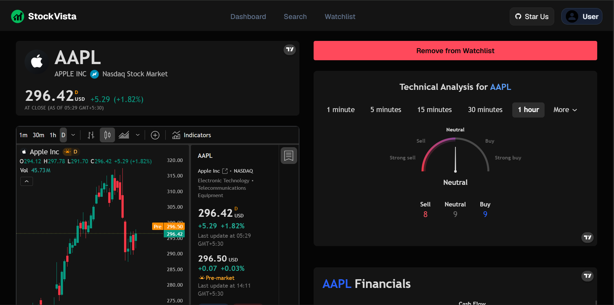

<h1 align="center">
  StockVista
  <a href="https://stockvista-one.vercel.app">
    • Live Demo
  </a>
</h1>

<p align="center">
Modern stock market platform for tracking stocks, managing watchlists, and setting real-time price alerts.
</p>

<p align="center">
  📈 Track Stocks • ⭐ Watchlists • 🔔 Price Alerts • 📧 Email Notifications
</p>

<p align="center">
  
  
  
  
</p>

---

## 🚀 Features

* Search stocks by ticker or company name
* Personalized watchlists
* Real-time market data from Finnhub
* Interactive TradingView charts
* One-time and recurring price alerts
* Welcome and alert email notifications
* Secure authentication with NextAuth
* Optimized API usage and caching

---

## 🛠️ Tech Stack

**Frontend:** Next.js 16, React, TypeScript, Tailwind CSS, shadcn/ui

**Backend:** MongoDB, Mongoose, Next.js Server Actions

**Services:** Finnhub API, TradingView Widgets, Auth.js, Nodemailer

**Deployment:** Vercel

---

## 📸 Screenshots

### 📊 Dashboard

<p align="center">
  
</p>

### 🔍 Stock Search

<p align="center">
  
</p>

### ⭐ Watchlist & Alerts

<p align="center">
  
</p>

### 📈 Stock Details

<p align="center">
  
</p>

---

## ⚙️ Getting Started

```bash
git clone https://github.com/stackdev-ash/StockVista.git

cd StockVista

npm install

npm run dev
```

Create a `.env.local` file:

```env
MONGODB_URL=

NEXTAUTH_SECRET=
NEXTAUTH_URL=

FINNHUB_API_KEY=
NEXT_PUBLIC_FINNHUB_API_KEY=

NODEMAILER_EMAIL=
NODEMAILER_PASSWORD=
```

Open:

```txt
http://localhost:3000
```

---

## 📝 Notes

* Price alert functionality is fully implemented and tested.
* Daily recurring alert emails are intentionally disabled in production to prevent automated emails from being sent through a personal SMTP account.
* To enable recurring alerts, create a `vercel.json` file and configure a Vercel Cron Job to call `/api/check-alerts` on a schedule.

Example:

```json
{
  "crons": [
    {
      "path": "/api/check-alerts",
      "schedule": "0 9 * * *"
    }
  ]
}
```

This configuration will run the alert checker once daily at 09:00 UTC.

---

## 🔮 Future Improvements

* Portfolio tracking
* Daily market news summaries
* Watchlist-specific news feed
* Advanced analytics

---

## ⭐ Support

If you found this project useful, consider starring the repository:

https://github.com/stackdev-ash/StockVista
